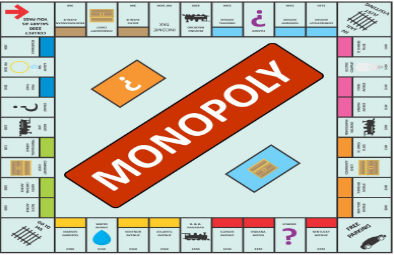

# Task 1 - Monopoly Board

Create a visually appealing Monopoly board using HTML, CSS, and BS5.

Board Layout:
- The board should be square and divided into 40 spaces.
- Ignore any images.
- Corner spaces should be larger than normal spaces
- Ensure accurate placement of all spaces around the board, mimicking the original Monopoly board.

Property Spaces:
- Use the BS5 grid system to create evenly spaced property cells.
- Ignore all text and images inside a property.
- Use different colors to mark each property group.

Styling and Design:
- Use CSS to style the board and each space for a polished and professional look.
- Apply Bootstrap classes for adaptable design and layout.
- Ensure the board is centered on the page and scales appropriately on different screen sizes.
- You need to use at least two css pseudo class.

Bonus:
- Add text(name, and price) to each property.
- Add necessary images to create an actual monopoly board.

